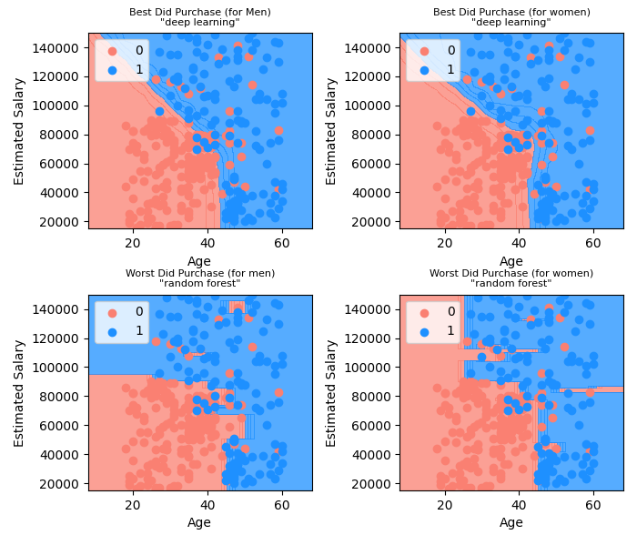

# Machine Learning Projects

Some Machine Learning Project(s)

## Breast Cancer CNN Deep Neural Network

[link to jupyter notebook](https://github.com/ZahraSarrafi/machine-learning-projects/blob/main/projects/Breast-Cancer-CNN/src/notebook.ipynb)

```bash
confusion matrix [[441, 59], [33, 367]]
 -> is not malignant prediction
   -> correct   441
   -> incorrect 33
 -> is malignant prediction
   -> correct   367
   -> incorrect 59
accuracy_score 0.8977777777777778
```

## Bank Customer Churn Analysis

[link to jupyter notebook](https://github.com/ZahraSarrafi/machine-learning-projects/blob/main/projects/Bank-Customer-Churn/Bank-Churn-Dataset.ipynb)

## Country Data Analysis

[link to jupyter notebook](https://github.com/ZahraSarrafi/machine-learning-projects/blob/main/projects/Country-Data-Analysis/country-data-analysis.ipynb)

## Indoor Temperature Analysis

[link to jupyter notebook](https://github.com/ZahraSarrafi/machine-learning-projects/blob/main/projects/Indoor_Temperature/indoor-temp.ipynb)

## Result of Classification for Social Ads



## Accuracy of Tumor Classification 
```
-> deep learning       0.971
-> logistic regression 0.956
-> k-nearest-neighbors 0.956
-> svc                 0.956
-> decision tree       0.956
-> naive bayes         0.949
-> random forest       0.949
```

## Accuracy of Customer Reviews NLP Classification 
```
-> LogisticRegression 0.865
-> svc                0.85
-> ann                0.825
-> Catboost           0.795
-> random forest      0.785
-> decision tree      0.78
-> GaussianNB         0.745
-> KNeighbors         0.575
```

### Single Review Prediction
```
########################
 -> custom sentence -> 'the food was amazing'
 -> we expect: True
 ---> prediction 'logistic regression' say True -----> SUCCESS
 ---> prediction 'svc                ' say True -----> SUCCESS
 ---> prediction 'deep learning      ' say True -----> SUCCESS
 ---> prediction 'random forest      ' say True -----> SUCCESS
 ---> prediction 'decision tree      ' say True -----> SUCCESS
 ---> prediction 'naive bayes        ' say True -----> SUCCESS
 ---> prediction 'k-nearest-neighbors' say True -----> SUCCESS
########################
 -> custom sentence -> 'the food was great'
 -> we expect: True
 ---> prediction 'logistic regression' say True -----> SUCCESS
 ---> prediction 'svc                ' say True -----> SUCCESS
 ---> prediction 'deep learning      ' say True -----> SUCCESS
 ---> prediction 'random forest      ' say True -----> SUCCESS
 ---> prediction 'decision tree      ' say True -----> SUCCESS
 ---> prediction 'naive bayes        ' say True -----> SUCCESS
 ---> prediction 'k-nearest-neighbors' say True -----> SUCCESS
########################
 -> custom sentence -> 'the food was good'
 -> we expect: True
 ---> prediction 'logistic regression' say True -----> SUCCESS
 ---> prediction 'svc                ' say True -----> SUCCESS
 ---> prediction 'deep learning      ' say True -----> SUCCESS
 ---> prediction 'random forest      ' say True -----> SUCCESS
 ---> prediction 'decision tree      ' say True -----> SUCCESS
 ---> prediction 'naive bayes        ' say True -----> SUCCESS
 ---> prediction 'k-nearest-neighbors' say True -----> SUCCESS
########################
 -> custom sentence -> 'slow service but great taste'
 -> we expect: True
 ---> prediction 'logistic regression' say True -----> SUCCESS
 ---> prediction 'svc                ' say False -----> FAILURE
 ---> prediction 'deep learning      ' say False -----> FAILURE
 ---> prediction 'random forest      ' say False -----> FAILURE
 ---> prediction 'decision tree      ' say True -----> SUCCESS
 ---> prediction 'naive bayes        ' say False -----> FAILURE
 ---> prediction 'k-nearest-neighbors' say False -----> FAILURE
########################
 -> custom sentence -> 'the food was bad'
 -> we expect: False
 ---> prediction 'logistic regression' say False -----> SUCCESS
 ---> prediction 'svc                ' say False -----> SUCCESS
 ---> prediction 'deep learning      ' say False -----> SUCCESS
 ---> prediction 'random forest      ' say False -----> SUCCESS
 ---> prediction 'decision tree      ' say False -----> SUCCESS
 ---> prediction 'naive bayes        ' say False -----> SUCCESS
 ---> prediction 'k-nearest-neighbors' say False -----> SUCCESS
########################
 -> custom sentence -> 'I'll will not order from them again'
 -> we expect: False
 ---> prediction 'logistic regression' say False -----> SUCCESS
 ---> prediction 'svc                ' say False -----> SUCCESS
 ---> prediction 'deep learning      ' say False -----> SUCCESS
 ---> prediction 'random forest      ' say False -----> SUCCESS
 ---> prediction 'decision tree      ' say False -----> SUCCESS
 ---> prediction 'naive bayes        ' say True -----> FAILURE
 ---> prediction 'k-nearest-neighbors' say False -----> SUCCESS
########################
 -> custom sentence -> 'avoid that place'
 -> we expect: False
 ---> prediction 'logistic regression' say False -----> SUCCESS
 ---> prediction 'svc                ' say False -----> SUCCESS
 ---> prediction 'deep learning      ' say False -----> SUCCESS
 ---> prediction 'random forest      ' say False -----> SUCCESS
 ---> prediction 'decision tree      ' say True -----> FAILURE
 ---> prediction 'naive bayes        ' say False -----> SUCCESS
 ---> prediction 'k-nearest-neighbors' say False -----> SUCCESS
 ```

## Accuracy of Mental Health NLP Classification

* the pre-processed dataset is saved and reused (faster restart)
    * now ~6sec, was ~400sec
* some models are saved (further faster restart)
    * catboost (now ~1sec, was ~90sec)
    * xgboost (now ~1sec, was ~20sec)
    * ann (deep learning, now ~1sec, was ~170sec)

```
sorted
-> svc                0.7338908017707821
-> Catboost           0.7289719626168224
-> ann                0.7260206591244466
-> LogisticRegression 0.7255287752090507
-> xgboost            0.7225774717166749
-> random forest      0.6487948844072798
-> KNeighbors         0.6064928676832267
-> decision tree      0.5779636005902608
-> GaussianNB         0.48844072798819477
```

